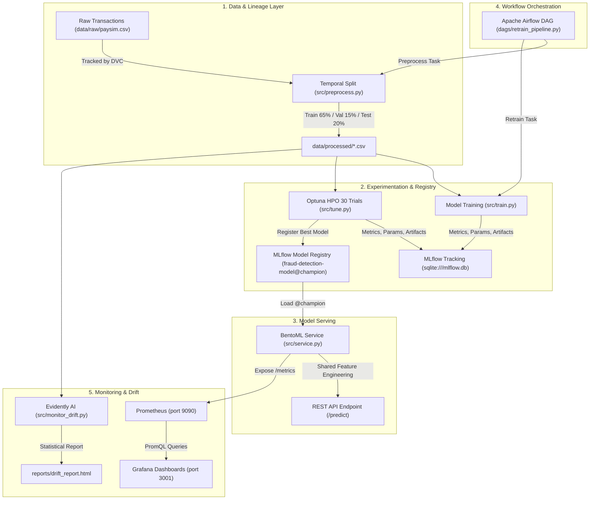
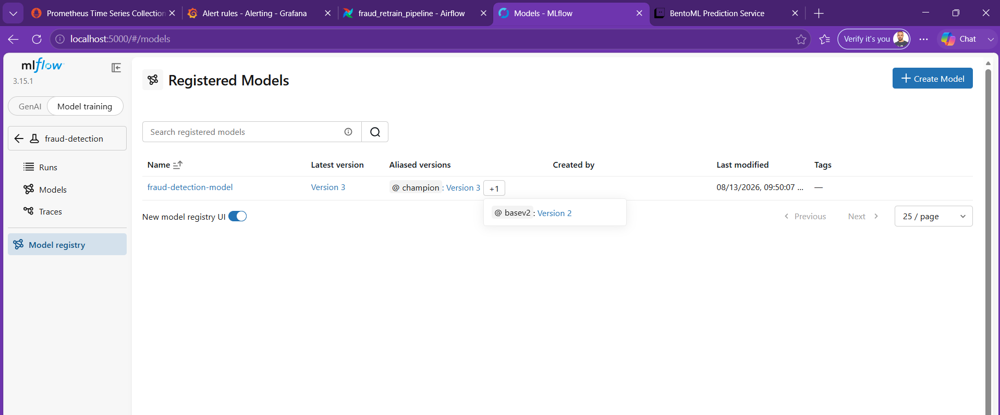
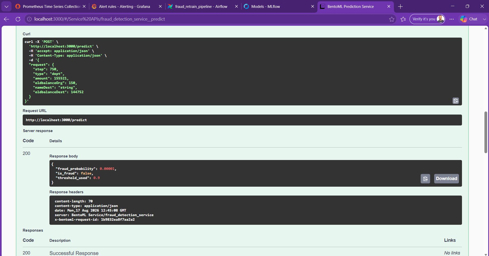
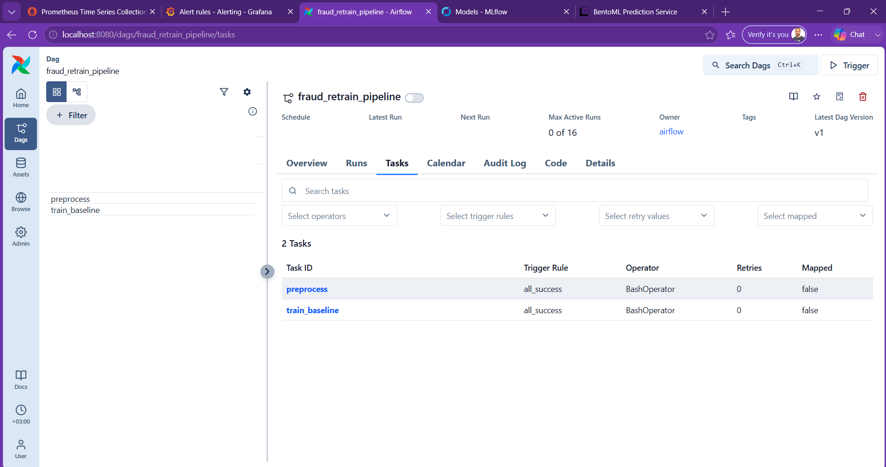
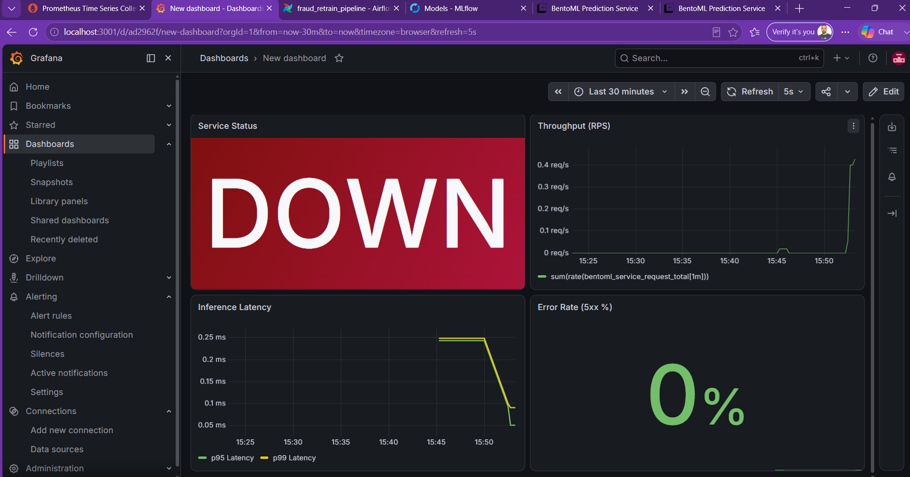
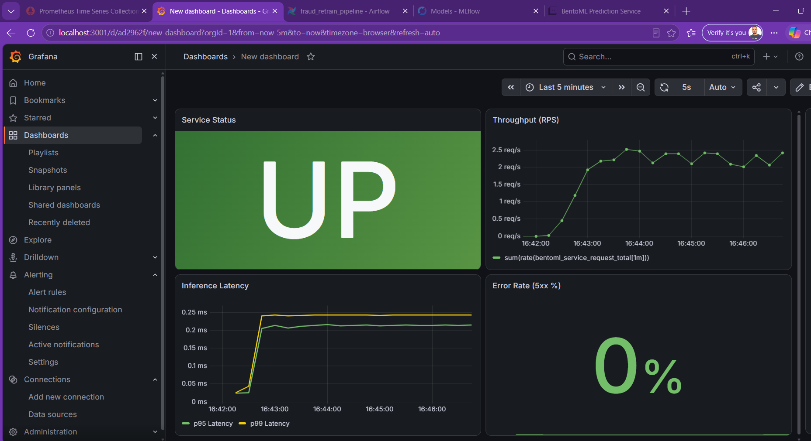

# End-to-End MLOps Pipeline for Financial Fraud Detection

An educational, end-to-end MLOps lifecycle implementation for detecting financial transaction fraud on the synthetic PaySim dataset (6.36M+ transactions). Designed as a practical, portfolio-grade engineering project, it demonstrates how to build and connect each stage of the machine learning operations lifecycle: data versioning with DVC, temporal feature engineering to eliminate train-serving skew and data leakage, XGBoost model training and Optuna Bayesian optimization tracked via MLflow, real-time REST API serving with BentoML, containerized retraining orchestration using Apache Airflow in Docker, metrics collection and visualization with Prometheus & Grafana, and automated statistical drift monitoring with Evidently AI.

---

## Architecture Overview



---

## Tech Stack & Tooling

| Technology | Role / Concrete Purpose in Architecture |
| :--- | :--- |
| **Git & DVC** | Code version control and large-scale data versioning / lineage tracking without bloating git history. |
| **Python & Pandas** | Vectorized temporal data manipulation, feature extraction, and dataset partitioning. |
| **XGBoost** | High-performance gradient boosted decision trees optimized for extreme class imbalance (`scale_pos_weight`). |
| **Optuna** | Bayesian hyperparameter optimization (Tree-structured Parzen Estimator) maximizing Precision-Recall AUC (**PR-AUC**). |
| **MLflow** | Experiment tracking, hyperparameter logging, model artifact storage, signature verification, and Model Registry management (`champion` alias). |
| **BentoML** | High-throughput microservice serving real-time model inference with shared feature engineering. |
| **Apache Airflow** | Scheduled workflow orchestration containerized in Docker Standalone mode for automated retraining pipelines. |
| **Prometheus** | Time-series database scraping service health and inference performance metrics every 5 seconds. |
| **Grafana** | Operational dashboards visualizing request throughput (RPS), p95/p99 latencies, error rates, and alerting rules. |
| **Evidently AI** | Per-column statistical distribution comparison (Wasserstein & Jensen-Shannon distances) for data & target drift detection. |
| **Docker & Compose** | Containerized deployment with isolated networks and persistent named volumes. |

---

## Data Pipeline & Feature Engineering Showcase

### Raw Transaction Schema (Before Preprocessing)

First 5 records from [`data/raw/paysim.csv`](file:///home/moalr/fraud-mlops/data/raw/paysim.csv):

| step | type | amount | nameOrig | oldbalanceOrg | newbalanceOrig | nameDest | oldbalanceDest | newbalanceDest | isFraud | isFlaggedFraud |
| ---: | :--- | ---: | :--- | ---: | ---: | :--- | ---: | ---: | ---: | ---: |
| 1 | PAYMENT | 9839.64 | C1231006815 | 170136.00 | 160296.36 | M1979787155 | 0.0 | 0.0 | 0 | 0 |
| 1 | PAYMENT | 1864.28 | C1666544295 | 21249.00 | 19384.72 | M2044282225 | 0.0 | 0.0 | 0 | 0 |
| 1 | TRANSFER | 181.00 | C1305486145 | 181.00 | 0.00 | C553264065 | 0.0 | 0.0 | 1 | 0 |
| 1 | CASH_OUT | 181.00 | C840083671 | 181.00 | 0.00 | C38997010 | 21182.0 | 0.0 | 1 | 0 |
| 1 | PAYMENT | 11668.10 | C2048537720 | 41554.00 | 29885.90 | M1230701703 | 0.0 | 0.0 | 0 | 0 |

---

### Processed Training Schema (After Feature Engineering)

First 5 records from [`data/processed/train.csv`](file:///home/moalr/fraud-mlops/data/processed/train.csv):

| transaction_id | step | amount | oldbalanceOrg | oldbalanceDest | isMerchantDest | hourOfDay | type_CASH_OUT | type_DEBIT | type_PAYMENT | type_TRANSFER | isFraud |
| ---: | ---: | ---: | ---: | ---: | ---: | ---: | ---: | ---: | ---: | ---: | ---: |
| 0 | 1 | 9839.64 | 170136.0 | 0.0 | 1 | 1 | 0 | 0 | 1 | 0 | 0 |
| 1 | 1 | 1864.28 | 21249.0 | 0.0 | 1 | 1 | 0 | 0 | 1 | 0 | 0 |
| 2 | 1 | 181.00 | 181.0 | 0.0 | 0 | 1 | 0 | 0 | 0 | 1 | 1 |
| 3 | 1 | 181.00 | 181.0 | 21182.0 | 0 | 1 | 1 | 0 | 0 | 0 | 1 |
| 4 | 1 | 11668.10 | 41554.0 | 0.0 | 1 | 1 | 0 | 0 | 1 | 0 | 0 |

---

### Feature Engineering & Data Leakage Elimination

1. **Temporal Cycle (`hourOfDay`):** Extracted via `step % 24` to capture daily cyclical transaction peaks and off-peak fraudulent patterns.
2. **Merchant Flag (`isMerchantDest`):** Binary indicator (`1` if `nameDest` begins with `"M"`, else `0`).
3. **Fixed One-Hot Encoding:** Categorical transaction type encoded using fixed `CategoricalDtype(["CASH_IN", "CASH_OUT", "DEBIT", "PAYMENT", "TRANSFER"])` with `drop_first=True` to guarantee identical dummy schema in batch processing and single-row live inference requests.
4. **Causal Data Leakage Removal:**
   * Features `newbalanceOrig` and `newbalanceDest` were **explicitly removed**. In real-world payment flows, post-transaction account balances are only updated *after* a transaction settles. Training with post-transaction balances causes severe data leakage, artificially inflating offline metrics while failing during real-time pre-authorization scoring.
5. **Temporal Partitioning Strategy:**
   * Transactions are chronologically ordered by `step`.
   * **Train:** Steps $\le 65^{\text{th}}$ percentile (approx. 4.15M rows, fraud rate: 0.082%).
   * **Validation:** Steps $> 65^{\text{th}}$ and $\le 80^{\text{th}}$ percentile (approx. 954K rows, fraud rate: 0.087%).
   * **Test:** Steps $> 80^{\text{th}}$ percentile (approx. 1.25M rows, fraud rate: 0.340%).

---

## Annotated Project Structure

```text
fraud-mlops/
├── .dvc/                             # DVC internal metadata, cache configurations, and pointer setup
│   ├── .gitignore                    # Prevents DVC internal caches and local credentials from committing
│   └── config                        # DVC storage and remotes configuration
├── .dvcignore                        # Patterns and directories excluded from DVC tracking
├── .gitignore                        # Root gitignore protecting large CSVs, virtual environments, and secrets
├── dags/
│   └── retrain_pipeline.py           # Apache Airflow DAG orchestrating sequential preprocessing & retraining
├── data/
│   ├── processed/                    # Partitioned datasets (train.csv, validation.csv, test.csv)
│   │   └── .gitkeep                  # Preserves folder in git while CSVs remain ignored
│   └── raw/
│       ├── .gitignore                # Ignores large raw paysim.csv
│       ├── paysim.csv                # 493MB raw transactions dataset (tracked by DVC)
│       └── paysim.csv.dvc            # DVC tracking pointer storing MD5 hash and file size metadata
├── docker/
│   ├── airflow/
│   │   ├── .env                      # AIRFLOW_UID & GID environment definitions
│   │   ├── Dockerfile                # Custom Airflow image with Python 3.11 and project requirements
│   │   ├── docker-compose.yml        # Airflow standalone service with persistent named volume
│   │   └── entrypoint.sh             # Custom idempotent entrypoint initializing database & fixed admin user
│   └── monitoring/
│       ├── docker-compose.yml        # Prometheus & Grafana multi-container stack with persistent volumes
│       └── prometheus.yml            # Prometheus scrape configuration targeting BentoML /metrics on host
├── images/                           # Visual documentation gallery of running production UI components
│   ├── AirFlow.png                   # Apache Airflow DAG UI & execution graph
│   ├── BentoML.png                   # BentoML interactive Swagger OpenAPI documentation
│   ├── Grafana.png                   # Real-time traffic, latency, and throughput Grafana dashboard
│   ├── GrafanaUP.png                 # Service uptime, availability, and alerting dashboard
│   └── MLflow.png                    # MLflow Tracking UI run comparison & model registry
├── mlruns/                           # MLflow local tracking directory (experiments, runs, artifacts)
│   └── .gitkeep                      # Preserves tracking folder structure in Git
├── reports/
│   └── drift_report.html             # Evidently AI interactive statistical drift analysis report
├── scripts/
│   └── load_test.py                  # Standalone load generator simulating steady & burst HTTP traffic
├── src/
│   ├── monitor_drift.py              # Statistical data and target drift detection using Evidently AI
│   ├── preprocess.py                 # Shared feature engineering, cleaning, and temporal data splitting
│   ├── service.py                    # BentoML production service loading MLflow champion model
│   ├── train.py                      # Baseline XGBoost training with threshold analysis and MLflow logging
│   └── tune.py                       # Bayesian HPO (Optuna) registering best model to MLflow Model Registry
├── mlflow.db                         # SQLite backend tracking database for MLflow experiments
└── requirements.txt                  # Python dependencies across modeling, serving, and orchestration
```

---

## Key Engineering Decisions & Lessons Learned

### 1. Eliminating Train-Serving Skew via Shared Feature Engineering
In many architectures, feature transformations for batch training (e.g. Scikit-Learn pipelines) differ from the single-record dictionary manipulation done in online API servers. This project solves this by using a centralized, pure-Pandas transformation function [`build_features()`](file:///home/moalr/fraud-mlops/src/preprocess.py#L22-L55) with categorical category anchoring (`CategoricalDtype`). Both batch CSV generation and BentoML single-row `POST /predict` calls execute the exact same transformation function, guaranteeing identical column signatures and zero skew.

### 2. Business-Driven Threshold Optimization
Because financial fraud is heavily imbalanced (~0.08% positive rate), evaluating models with standard Accuracy or ROC-AUC is misleading. The pipeline prioritizes **PR-AUC (Precision-Recall Area Under Curve)**. Furthermore, offline threshold analysis revealed that adjusting the classification threshold from the default `0.5` to `0.9` drastically reduces costly False Positives while preserving high fraud detection recall:

$$\text{Decision Rule: } \hat{y} = \begin{cases} 1 & \text{if } P(\text{isFraud} \mid \mathbf{x}) \ge 0.90 \\ 0 & \text{otherwise} \end{cases}$$

### 3. Infrastructure & Volume Persistence
* **WSL2 Docker Volume Permissions:** Configured explicit user mapping (`AIRFLOW_UID=1000`) and Docker named volumes (`airflow_home`, `prometheus_data`, `grafana_data`) to prevent container permission errors on Linux/WSL2 hosts.
* **Airflow 3 Idempotent Authentication:** Implemented an automated [`entrypoint.sh`](file:///home/moalr/fraud-mlops/docker/airflow/entrypoint.sh) script ensuring fixed administrative credentials (`admin` / `admin123`) persist cleanly across container rebuilds and restarts without relying on transient stdout files.
* **Host Gateway Scraping:** Utilized `extra_hosts: ["host.docker.internal:host-gateway"]` in Prometheus to allow the Docker container to reliably scrape the BentoML server running natively on the host (`http://localhost:3000/metrics`).

---

## Model Evaluation & Experiment Results

All experiments were executed with reproducible random seeds and logged directly to MLflow.

| Model / Experiment Stage | Precision | Recall | F1-Score | PR-AUC (Primary Metric) | ROC-AUC | Optimal Threshold |
| :--- | :---: | :---: | :---: | :---: | :---: | :---: |
| **XGBoost Baseline** | 0.1170 | **0.9739** | 0.2090 | 0.8648 | **0.9996** | 0.50 |
| **Optuna Tuned Model (Champion)** | **0.1216** | 0.9701 | **0.2161** | **0.8669** | **0.9996** | **0.90** |

> **Key Takeaway:** The Optuna Bayesian hyperparameter study explored 30 trials over max depth, learning rate, subsample ratios, and tree column sampling. The champion model achieved an improved PR-AUC of **0.8669**, and when operated at the optimized **0.90 threshold**, F1-score jumped to **0.5442** with high precision.

---

## Visual Pipeline & Monitoring Gallery

### 1. MLflow Experiment Tracking & Model Registry

*Tracking all 30 Optuna optimization trials, metric histories, hyperparameters, and model versioning in the MLflow Model Registry with the `champion` alias.*

---

### 2. BentoML Real-Time Model Serving

*Interactive OpenAPI / Swagger documentation interface for the BentoML microservice hosting real-time predictions at `/predict`.*

---

### 3. Apache Airflow Retraining Orchestration

*Apache Airflow Standalone UI managing the sequential `preprocess >> train_baseline` data preparation and model retraining DAG.*

---

### 4. Grafana Real-Time Performance Dashboard

*Live monitoring dashboard visualizing incoming request rates, p95/p99 latency distributions, and throughput spikes generated during load testing.*

---

### 5. Service Health & Uptime Alerting

*Availability monitoring tracking target scrape health in Prometheus and validating alert triggering during simulated service outages.*

---

## Setup & Execution Guide

### Prerequisites
- Python 3.10+ (Python 3.11/3.14 tested)
- Docker & Docker Compose
- Git & DVC

### 1. Environment Setup
```bash
# Clone the repository
git clone https://github.com/mohammedAlrobae/fraud-mlops.git
cd fraud-mlops

# Create and activate virtual environment
python3 -m venv .venv
source .venv/bin/activate

# Install dependencies
pip install -r requirements.txt
pip install evidently
```

### 2. Data Preparation
```bash
# Pull raw dataset via DVC (if remote configured) or verify data/raw/paysim.csv
dvc status

# Run feature engineering and temporal splitting
python3 src/preprocess.py
```

### 3. Model Training, Tuning & MLflow Registry
```bash
# Start MLflow tracking server in background
nohup mlflow ui --backend-store-uri sqlite:///mlflow.db > /tmp/mlflow_ui.log 2>&1 &

# Train baseline model
python3 src/train.py

# Run Optuna Bayesian tuning and register Champion model
python3 src/tune.py
```

### 4. Real-Time Model Serving (BentoML)
```bash
# Serve champion model via BentoML
bentoml serve src/service.py:FraudDetectionService
```
* Access Swagger UI: http://localhost:3000
* Metrics Endpoint: http://localhost:3000/metrics

### 5. Launch Monitoring Infrastructure (Prometheus & Grafana)
```bash
# Start Prometheus & Grafana stack
cd docker/monitoring
docker-compose up -d
cd ../..
```
* Prometheus UI: http://localhost:9090
* Grafana UI: http://localhost:3001 (User: `admin`, Password: `admin`)

### 6. Launch Airflow Retraining Pipeline
```bash
# Start Airflow container
cd docker/airflow
docker-compose up -d
cd ../..
```
* Airflow Web UI: http://localhost:8080 (User: `admin`, Password: `admin123`)

---

## Standalone Utilities & Future Roadmap

### Standalone Utilities
1. **Realistic Traffic Simulator ([`scripts/load_test.py`](file:///home/moalr/fraud-mlops/scripts/load_test.py)):** Generates alternating steady and concurrent burst traffic against the live BentoML service to test Grafana alerting rules and latency distributions under load.
2. **Statistical Drift Detector ([`src/monitor_drift.py`](file:///home/moalr/fraud-mlops/src/monitor_drift.py)):** Runs normalized Wasserstein and Jensen-Shannon distance metrics comparing historical reference distributions (`train.csv`) to current batches (`test.csv`), saving an interactive HTML report to [`reports/drift_report.html`](file:///home/moalr/fraud-mlops/reports/drift_report.html).

### Future Roadmap
- [ ] **Streaming Ingestion:** Implement real-time Apache Kafka and Apache Flink pipeline simulating continuous transaction streams into BentoML.
- [ ] **Automated Retraining Triggers:** Connect Evidently drift detection alerts via webhooks directly to Airflow's REST API to trigger DAG runs automatically when significant feature drift is detected.
- [ ] **Kubernetes Deployment:** Package the BentoML service into a containerized Helm chart deployed on Minikube / EKS with horizontal pod autoscaling (HPA).
